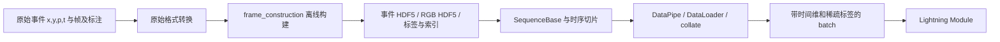
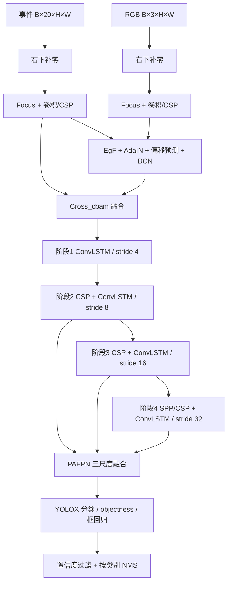

# FAOD 工程入门：从论文到代码、数据和实验

2026-09-14 更新：PKU 全量解压已完成，原模型真实数据 FP32 100 步训练、参数更新核对、checkpoint 保存与单序列 Val 回读均已通过。详细配置、兼容性修复及限制见 [短训练结果](PKU_TRAIN_SMOKE_RESULTS.md)。

这份指南面向首次接手 FAOD 的读者，阅读目标是能回答：模型究竟在哪里定义、一份样本经过哪些变换、loss 从哪里来、验证指标如何产生，以及改一个配置会影响什么。

解析对象为当前 `HWAware_FAOD` 工作区，Git 基线 `0e6cf34322c04a0a0d0bf498e57f55d21cb1a701`，包含此前环境适配和本地 checkpoint 路径修改。日期：2026-09-13。论文参照作者的 [FAOD，arXiv:2412.04149v1](https://arxiv.org/html/2412.04149v1)。**以下具体行为以当前源码为准；论文的概念图、代码中的类名和实际执行路径需要分别核对。**

配套资料：

- [全部源码与配置索引](FAOD_SOURCE_INDEX.md)：280 个 Python 文件和 25 个 YAML 配置的入口索引，包含备用实现。
- [实际验证与短训练命令](VALIDATION_AND_SMOKE_TRAINING.md)：待数据就绪后的操作手册。
- [环境适配记录](ENVIRONMENT.md)、[下载方法](DATASET_DOWNLOAD.md)、[本地权重](../checkpoints/README.md)。
- [PKU 逐层形状记录](../codex_artifacts/reference/pku_model_trace.json)、[DSEC 逐层形状记录](../codex_artifacts/reference/dsec_model_trace.json)：本轮在 CPU 上实际运行默认模型得到。

建议第一次依次阅读 1–8 节；准备跑实验时读 9–12 节；准备改模型时读 13–16 节。全工程索引用于定位文件，不必先逐行读完所有备用库。

<details>
<summary>展开章节目录</summary>

1. [基本概念与论文映射](#1-先建立四个基本概念)
2. [工程分层](#2-工程分层和最重要的阅读路线)
3. [Hydra 配置](#3-hydra一个命令如何决定运行哪条路径)
4. [数据格式与时间索引](#4-数据的三种层次与文件格式)
5. [random / stream / mixed 加载](#5-数据加载randomstreammixed-分别解决什么)
6. [默认模型与张量形状](#6-模型前向一对事件与-rgb-如何成为检测)
7. [对齐、融合与记忆](#7-alignfusion-和记忆逐个拆开看)
8. [检测头与 loss](#8-检测头与监督信号)
9. [训练调度与 checkpoint](#9-优化器训练调度与-checkpoint)
10. [Val / Test 与 AP](#10-valtest从原始预测到-ap)
11. [调参和故障定位](#11-调参时先分清运行参数与研究改动)
12. [实验推进路线](#12-一条可执行的实验推进路线)
13. [备用分支边界](#13-默认路径之外已发现的实现边界)
14. [EfficientViT / PEOD 整合](#14-后续-efficientvit-与-peod-整合的清晰边界)
15. [入门调试练习](#15-入门练习沿一条样本学会调试)
16. [本轮验证范围](#16-本轮解析与验证的范围)

</details>

## 1. 先建立四个基本概念

**事件点与事件帧。** 原始事件是一条 `(x, y, p, t)` 记录，表示某位置在某时刻发生了亮度变化。FAOD 当前入口接收的是将许多事件聚合后的多通道张量，而非原始点列表。

**空间特征与时间状态。** 卷积主干提取“当前输入里有什么”；每个阶段的 ConvLSTM 保存过去的信息。两者一起组成代码中的 recurrent backbone。

**训练与推理。** 推理输入事件、RGB 和前一时刻状态，输出检测及新状态。训练额外提供标注，用检测误差更新参数。状态随序列演化，模型参数由优化器更新，二者不是同一个对象。

**Val 与 Test。** Val 用于观察训练和选择 checkpoint；Test 用于最终报告。两者复用很多计算，但应使用各自分区。`validation.py` 可执行两者；默认 `use_test_set=true` 实际执行 Test。

### 1.1 论文概念对应到哪里

论文区分 Event–RGB 频率不匹配和训练–推理频率不匹配；方法重点是浅层对齐融合、时间状态以及 Time Shift 训练。建议对照论文第 3 节和 Figure 3 阅读下表。[论文方法部分](https://arxiv.org/html/2412.04149v1#S3)。

| 论文中的概念 / 位置 | 当前工程中的对应位置 | 阅读时关注 |
| --- | --- | --- |
| Event representation，§3.1 | `StackedHistogram`，`frame_construction/utils/representations.py` | 极性、时间桶和通道顺序 |
| 主结构，§3.2 / Fig.3(a) | `darknet_rnn_forward_fusion.RNNDetector` | 首阶段融合，后续阶段处理融合特征 |
| CSPDark-LSTM，Fig.3(b) | `RNNDetectorStage` + `DWSConvLSTM2d` | 卷积输出与 `(h,c)` 状态 |
| Align，§3.3 / Fig.3(c) | `Feature_wrapper` → `EgF` / AdaIN / `ALIGN` | 偏移估计与被采样的 RGB 特征 |
| EF Fusion，Fig.3(d) | `Cross_cbam` | 跨模态通道门控、空间门控 |
| Time Shift，§3.3 | `SequenceForRandomAccess` / `SequenceForIter` | RGB 读入索引减去 drift，标签跟随事件 |
| 频率适应实验，§3.4 | `frame_construction/main.py`、`main_dsec.py` | RGB 复用频率与事件表征输出频率 |
| 实验训练流程，§4.1 | `train.py`、Lightning Module、mixed DataLoader | 采样、状态、优化器与 scheduler |

后文逐项展开的是本仓库的实际实现，而非照抄论文图。附录中的备用网络也不自动等于当前已验证的运行路径。

### 1.2 阅读源码时常见的词

| 名称 | 在本工程中的含义 |
| --- | --- |
| tensor / feature map | 多维数值数组 / 网络提取的空间特征，常写成 `[B,C,H,W]` |
| B、C、H、W、L | batch 大小、通道数、高、宽、序列长度 |
| stride | 特征相对输入的空间下采样倍数，例如 stride 8 |
| GT / target | 人工标注或转换后的监督目标 |
| backbone / neck / head | 提取特征的主干 / 融合多尺度的颈部 / 输出框与类别的检测头 |
| objectness | 候选位置存在目标的预测分数，与类别分数相乘做筛选 |
| IoU | 两个框交集面积除以并集面积，用于匹配与评价 |
| NMS | 按分数抑制高度重叠的重复预测框 |
| epoch / step | 一轮 loader 迭代 / 一次训练批次对应的更新计数；流式采样的 epoch 不宜简单理解为原始帧只遍历一次 |
| FP32 / AMP | 单精度浮点 / 自动混合精度，不会改变输入的极性或通道定义 |
| BPTT / detach | 沿时间反向传播 / 切断跨片段反向图但保留状态数值 |

## 2. 工程分层和最重要的阅读路线

| 层次 | 主要文件 | 职责 |
| --- | --- | --- |
| 启动层 | [train.py](../train.py)、[validation.py](../validation.py)、[demo.py](../demo.py) | 读配置、创建对象、调用 Trainer 或推理 |
| 配置层 | [config/](../config/)、[modifier.py](../config/modifier.py) | 合并实验设置、补尺寸和类别数 |
| 数据组织层 | [ev_img_data_moudle.py](../data/data_module/ev_img_data_moudle.py) | 构建 train/val/test 数据和 DataLoader |
| 样本层 | [data/ev_img_dataloader/](../data/ev_img_dataloader/) | 读取 HDF5、对齐标签、裁取序列 |
| 训练编排层 | [detection_fusion.py](../modules/detection_fusion.py) | 时序循环、状态、选标签、loss 和指标 |
| 网络装配层 | [detector_fusion.py](../models/detection/yolox_extension/models/detector_fusion.py) | 组合 backbone、PAFPN、YOLOX head |
| 算子层 | [models/layers/](../models/layers/) | 空间提取、对齐、融合、循环记忆 |
| 评估层 | [utils/evaluation/prophesee/](../utils/evaluation/prophesee/) | 检测格式转换、时间匹配、COCO AP |
| 运行辅助层 | [callbacks/](../callbacks/)、[loggers/](../loggers/) | checkpoint、图像、梯度和 W&B |
| 离线处理层 | [frame_construction/](../frame_construction/) | 原始事件到可直接读取的事件表征 |

最值得沿着调试器走一遍的调用链：

```text
train.main(config)
  dynamically_modify_train_config(config)
  fetch_data_module(config) → DataModule
  fetch_model_module(config) → modules.detection_fusion.Module
  Trainer.fit(...)
    DataModule.setup('fit') → DataLoader
    Module.training_step → training_step_with_rnn
      merge_mixed_batches
      for each time step:
        forward_backbone_rnn
      forward_detect(selected_features, targets)
      返回 {'loss': ...}
    Lightning 自动 backward / 梯度裁剪 / optimizer.step / scheduler.step
```

`models/.../YoloXDetector` 是神经网络，`modules/.../Module` 是训练编排，`DataModule` 是数据组织。初学时把这三个同样带 Module 的对象分开理解，会明显减少混淆。

## 3. Hydra：一个命令如何决定运行哪条路径

示例：

```bash
python train.py dataset=pku_fusion +experiment/pku_fusion=base.yaml
```

配置会从 `config/train.yaml`、`general.yaml`、选定的数据集配置和实验配置合并。实验 `base.yaml` 又继承其 `default.yaml`，并引入 `model/maxvit_yolox/default.yaml`。同一项可能在多个文件出现，最终应查看合并结果及 modifier 补充后的配置，而不能只看 general.yaml。

不启动训练地查看配置：

```bash
python train.py dataset=pku_fusion +experiment/pku_fusion=base.yaml --cfg job
```

`--cfg job` 显示 Hydra 合并结果；`dynamically_modify_train_config` 位于 main 内，此时不会执行，所以动态填充项仍可能为 `???`。正常启动后的 Configuration 输出才包含类别数和最终尺寸。

### 3.1 默认配置的真实含义

| 配置 | 默认实验值 | 影响 |
| --- | --- | --- |
| `model.name` | `rnndet` | 总体时序检测模型类别 |
| `model.backbone.type` | `fusion` | 选择 fusion Lightning Module |
| `model.backbone.name` | `forward_fusion` | 首阶段融合的主干组织 |
| `model.backbone.backbone_type` | `darknet` | 默认空间提取代码 |
| `model.backbone.fusion_type` | `cross_cbam` | EF Fusion 实现 |
| `model.backbone.memory_type` | `lstm` | 每阶段使用 ConvLSTM |
| `model.backbone.enable_align` | `true` | RGB 特征对齐 |
| `model.backbone.using_align_loss` | `false` | 默认无附加特征对齐 MSE |
| `model.backbone.ev_input_channels` | `20` | 2 极性 × 10 时间桶 |
| `model.backbone.img_input_channels` | `3` | RGB 输入 |
| `model.fpn.in_stages` | `[2,3,4]` | 供检测使用的三个尺度 |
| `dataset.sequence_length` | PKU=11，DSEC=5 | 每次读取和反传的时序块长度 |
| `dataset.train.sampling` | `mixed` | 随机片段与连续片段共同训练 |
| `dataset.eval.sampling` | `stream` | 顺序评估，保持状态 |

**`maxvit_yolox` 是配置目录名，不代表默认网络是 MaxViT。** 工厂在 [recurrent_backbone/__init__.py](../models/detection/recurrent_backbone/__init__.py) 中读取具体字段后导入实现；默认实例是 `darknet_rnn_forward_fusion.RNNDetector`。

`modifier.py` 会把 PKU 类别数设成 3，DSEC 设成 8，并按 `32 × partition_split_32` 的倍数补齐输入尺寸。当前 split=2，因此按 64 的倍数补齐。手动改 `model.head.num_classes` 可能被 modifier 覆盖；新增数据集需要修改完整数据/类别映射。

## 4. 数据的三种层次与文件格式

### 4.1 原始数据 → 离线构建 → 训练样本



- `data/source_dataset_process/from_aedat4_to_h5.py` 和 `from_json_to_npy.py` 是原始格式转换脚本，有数据来源和目录假设。
- `frame_construction/main.py` / `main_dsec.py` 生成 FAOD 训练使用的组织形式。
- 正常训练从 HDF5 读现成表征，不会在每个 training_step 中重新聚合原始事件。

目录契约：

```text
<dataset.path>/
  train/、val/、test/
    <sequence>/
      event_representations_v2/
        stacked_histogram_dt=50_nbins=10/
          event_representations.h5       # data: [N_event,20,H,W]
          objframe_idx_2_repr_idx.npy    # 有标注帧索引 → 表征索引
          ...                           # 构建阶段产生的时间信息等
      labels_v2/
        images.h5                       # data: [N_image,H,W,3]
        labels.npz                      # labels + objframe_idx_2_label_idx
        timestamps_us.npy               # 离线时间信息
```

`dataset.path` 应指向分区的共同父目录。当前 loader 默认遍历分区下每个条目，并把它当作序列目录；不要在 `val/` 等目录混入说明文件或下载临时文件。

### 4.2 20 通道事件表征到底是什么

实现见 [frame_construction/utils/representations.py](../frame_construction/utils/representations.py) 的 `StackedHistogram`；[data/utils/representations.py](../data/utils/representations.py) 存在另一份实现。默认运行训练时主要读取已构建结果。

聚合过程按源码可写成：

1. 从一个时间窗取出事件，极性预先编码为 0/1。
2. 把时间映射到 10 个桶，末端索引 clamp 到第 9 桶。
3. 对同一 `(p,bin,y,x)` 的事件数量累加。
4. 按 cutoff 截断，合并极性维和时间桶维，得到 `[20,H,W]`。

内部先组织为 `[2,10,H,W]`，展平后的通道为 `channel = p*10 + bin`。因此通常是先一组极性的 10 桶，再另一组极性的 10 桶，而不是正负交替。默认预处理 YAML 的 `count_cutoff=10`；uint8 fastmode 先累加再截断，极高计数有溢出的可能，重新预处理时应检查这一点。

代码分桶使用所取事件集合的首末事件时间做归一化；不能假定它总是直接使用请求窗口的左右边界。目录名中的 `dt=50` 也不能代替实际时间戳核验。

**红绿事件可视化图只有颜色编码，不能恢复这 20 个时空计数通道。** 对 PEOD 等新数据，需要重新决定窗口、分桶、极性和坐标变换，不能只把 PNG 改名放进目录。

### 4.3 三个时间参数必须分开

| 参数 | 例子 | 控制什么 |
| --- | --- | --- |
| 事件积累窗长度 | `event_time_interval=50000` 微秒 | 每次表征回看多长时间 |
| 窗口内桶数 | `nbins=10` | 通道数、窗内时间分辨率 |
| 表征输出频率 | 原基准 × `event_upsampling_rate` | 多久向模型输入一次表征 |

例如输出 200 Hz 意味着相邻输入相隔 5 ms。如果窗口仍为 50 ms，相邻窗口会重叠；这并不意味着模型输入频率是 20 Hz，也不意味着需要把 50 ms 窗口自动缩短为 5 ms。

`frame_construction/main.py` 中事件窗口终点由帧间细分时间确定，起点是“终点减 event_interval_us”。这使积累窗口和输出间隔能独立变化。

### 4.4 RGB、标签与索引

[SequenceBase](../data/ev_img_dataloader/sequence_base.py) 做以下事情：

- 读取事件 `[N,C,H,W]` 并拆为长度 N 的 tensor 列表。
- 读取 RGB `[N,H,W,3]`，转成 `[3,H,W]`。
- 使用 `objframe_idx_2_repr_idx` 反向查找某表征时刻是否有标注。
- 从 `labels.npz` 中取出该帧的框集合。`labels` 是展平框表，不是每帧一个固定长度数组。

单框在 `ObjectLabels` 中按 `[t,x,y,w,h,class_id]` 表达。训练前才转成 YOLOX 所需的 `[class_id,cx,cy,w,h]`，坐标为像素，不是 0–1 归一化坐标。帧内框数不同时补零到 `[M,max_boxes,5]`。

无标注时使用 `None`；空框集合和 class_id=255 的占位也可能被转为 None。**没有标注不表示可以把整幅图当作确认无目标的负样本。** 当前路径会跳过这些时刻的检测监督。

读取函数不自动套用 ImageNet mean/std，也没有统一把 RGB 除以 255；训练循环主要做 dtype 转换和 padding。实际数值范围取决于 HDF5 中的内容。新的预处理若改成 0–1，应视为输入分布变化并重新验证，而不是默认与发布权重兼容。

### 4.5 索引偏移与 Time Shift

默认 `dataset.shift.label=true`、`dataset.shift.image=true` 是基础索引约定。对表征索引 `k`，代码大致读取：

```text
事件：repr[k]
标签：通过 repr 索引 k + int(label_shift) 查找
图像：images[k + int(image_shift) - drift]
```

以 `k=20` 为例，基础 label/image shift 均为 1：没有随机时移时，对应 repr 索引 21 的标签和 images[21]；drift=3 时标签保持不变，图像取 images[18]。这里“repr 索引 21 的标签”要经过映射，并不是 `labels` 的第 21 个框。

序列开头历史不足时，代码回退到未随机时移的图像范围；返回的 drift 元数据仍可能保留原采样值。默认附加对齐 loss 关闭，因此首轮应保持默认路径；若启用额外 MSE，需要额外审查这个边界。

这两个 `shift` 布尔开关与 `data_augmentation.*.unpair` 的随机时移是两层不同的设置，不能把它们都关掉当成“关闭 Time Shift”。

## 5. 数据加载：random、stream、mixed 分别解决什么

### 5.1 random：独立有标签片段

[dataset_rnd.py](../data/ev_img_dataloader/dataset_rnd.py) 构建 [SequenceForRandomAccess](../data/ev_img_dataloader/sequence_rnd.py)。以某个有标注位置作为片段末端，向前取 `sequence_length` 个表征。

- 每次取样都可以重新采样 drift。
- 每个片段 `IS_FIRST_SAMPLE=true`，进入模型前清空对应状态。
- 片段内部按时间逐步执行，梯度可以跨越该片段的多个时刻。
- `only_load_end_labels=false` 时，不只最后一个时刻能够参与训练监督；片段内其他有效标签也会被选出。

### 5.2 stream：连续片段与截断反传

[SequenceForIter](../data/ev_img_dataloader/sequence_for_streaming.py) 将一个序列切成连续片段。开头标记 first_sample，末端不足 L 时补零并将标签补成 None。

- 一个 stream 子序列首次读取时采样 drift，后续片段复用，避免片段间图像错位量随意跳变。
- `RNNStates` 保存最后状态，下一片段继续使用其数值。
- 保存时调用 `detach()`，跨片段不保留反向图，形成 truncated BPTT。
- 训练数据会切成“保证片段内有标签”的子序列；Val/Test 允许片段没有标签。

连续序列要保存在同一 worker 和稳定的 batch 槽位中。普通 `shuffle=True` 会破坏这种对应关系，因此项目使用自己的流式管线。

### 5.3 mixed：同一个 batch 中混合两种样本

[DataModule.set_mixed_sampling_mode_variables_for_train](../data/data_module/ev_img_data_moudle.py) 将总 batch 和 workers 拆成两份。默认每卡 batch=4、权重 1:1，通常得到 stream=2、random=2。

Lightning 将两个 loader 的输出交给训练模块；[merge_mixed_batches](../modules/utils/detection.py) 把 stream 样本放在前面、random 样本放在后面，并采用 stream worker_id。对应随机样本的状态每次都会 reset，因此可以共用一个状态容器。

这不是“每个 batch 同时把两份完整 batch=4 再拼成 8”。`batch_size.train` 是拆分前的总量。mixed 模式要求 train batch≥2、train workers≥2。

| 属性 | random | stream | mixed |
| --- | --- | --- | --- |
| 跨 batch 延续状态 | 每次重置 | 同序列延续 | 只延续 stream 部分 |
| 片段内反传 | 有 | 有 | 有 |
| 跨片段反传 | 无 | detach 后无 | detach 后无 |
| 训练片段有效标签 | 尽量保证末端/片段内有标签 | 构建时保证 | 两分支各自保证 |
| 主要用途 | 学习从有限上下文开始检测 | 学习长期连续状态 | 同时训练两种使用情形 |

### 5.4 一个 batch 的实际结构

[collate.py](../data/ev_img_dataloader/collate.py) 之后大致是：

```text
{
  'worker_id': int,
  'data': {
    DataType.EV_REPR:       长度 L 的列表，每项 [B,20,H,W],
    DataType.IMAGE:         长度 L 的列表，每项 [B,3,H,W],
    DataType.OBJLABELS_SEQ: 长度 L 的列表，每项含 B 个 ObjectLabels 或 None,
    DataType.IS_FIRST_SAMPLE: [B] 布尔标记,
    DataType.IS_PADDED_MASK:  时间/样本填充标记,
    DataType.DRIFT:          [B] 时移元数据
  }
}
```

默认 LSTM 路径使用时间列表逐时刻计算，不是把 `[L,B,C,H,W]` 原样传入 Conv2d。SSM 分支会采用不同的序列组织方式。

填充标记是数据契约的一部分，不代表网络自动停止处理填充时刻；默认循环仍会执行张量计算，通过标签 None 跳过相应检测监督。新序列开始时正确 reset 状态尤其重要。

### 5.5 训练与评估管线的区别

- [ConcatStreamingDataPipe](../data/utils/stream_concat_datapipe.py) 为训练构造、打乱和拼接流，可能重复样本；增强也在这条训练路径加入。
- [ShardedStreamingDataPipe](../data/utils/stream_sharded_datapipe.py) 为评估按 rank/worker 分片，维持顺序，以填充项补齐不同长度流。
- 不要为了加速评估而替换成训练 concat 管线，否则样本覆盖和 AP 会变化。
- 对默认 `eval.sampling=stream`，`get_sequences` 的评估分支没有传入训练的随机 unpair 参数，所以不会仅因为基础 YAML 中 unpair.prob=0.5 就自动给 Val 加随机时移。频率不匹配评估主要依赖离线构造好的数据。

## 6. 模型前向：一对事件与 RGB 如何成为检测

### 6.1 当前默认计算图



每个 ConvLSTM 都额外接收上一个时刻的 `(h,c)`，并返回新 `(h,c)`；图中省略了这四组时间连线，以避免与尺度连接混淆。

### 6.2 实际尺寸：用运行结果校验理解

以下来自新增 [inspect_faod_model.py](../scripts/inspect_faod_model.py) 的 CPU 运行。随机初始化和合成输入只用于结构检查；不是精度或速度测试。

| 节点 | 通道 / stride | PKU，batch=1 | DSEC，batch=1 |
| --- | --- | --- | --- |
| 原始空间尺寸 | — | 260×346 | 480×640 |
| 补零后输入 | E=20，I=3 | 320×384 | 512×640 |
| Stage 1 | 64 / 4 | `[1,64,80,96]` | `[1,64,128,160]` |
| Stage 2 | 128 / 8 | `[1,128,40,48]` | `[1,128,64,80]` |
| Stage 3 | 256 / 16 | `[1,256,20,24]` | `[1,256,32,40]` |
| Stage 4 | 512 / 32 | `[1,512,10,12]` | `[1,512,16,20]` |
| YOLOX 输出 | `5+num_classes` | `[1,2520,8]` | `[1,6720,13]` |

Stage 字典键是 `1,2,3,4`；PAFPN 选择其中 `2,3,4`。这些键的编号与 `nn.ModuleList` 的 0-based 索引不同。

[InputPadderFromShape](../utils/padding.py) 只在右侧和下侧补零，不缩放图像。框的左上坐标原点和像素尺度保持不变。把 padding 改为 resize，需要同步处理标签，不能只修改输入 tensor。

### 6.3 空间提取与浅层融合

默认主干定义在 [darknet_rnn_forward_fusion.py](../models/detection/recurrent_backbone/darknet_rnn_forward_fusion.py)。

第一阶段各有一条事件/RGB 浅层网络：`Focus_yolo` 将相邻 2×2 像素折到通道维，接卷积；后续 stride=2 卷积与 CSP 层使总下采样达到 4。这里两路仍然独立。

经过 Align 和 `Cross_cbam` 之后，只剩一条融合特征流。后续三个阶段不再分别保留独立的 RGB 和事件主干。这对应“只在浅层进行模态融合”的工程实现。

CSP 层通过分支和拼接提取特征，SPP 用不同大小的池化获得较大空间上下文。默认第 4 阶段包含 SPP。初学时先关注每阶段输入/输出和 stride，再深入内部 bottleneck。

### 6.4 参数数量与分布

实际统计：PKU 为 **20,263,400** 个参数，DSEC 为 **20,265,335** 个参数；差异来自类别相关的检测头。

| 部分 | 参数数 |
| --- | ---: |
| Stage 1（含双路浅层提取、Align、Fusion、LSTM） | 1,098,960 |
| Stage 2 | 609,792 |
| Stage 3 | 2,432,000 |
| Stage 4 | 10,370,560 |
| PAFPN | 3,860,992 |
| PKU head | 1,891,096 |
| DSEC head | 1,893,031 |

第 4 阶段参数最多，但运行耗时还取决于空间尺寸、算子实现和数据搬运，需要 profiler 证据，不能只凭参数数选择优化目标。

## 7. Align、Fusion 和记忆：逐个拆开看

### 7.1 Align 的实际数据流比概念图更细

阅读顺序：

[Feature_wrapper](../models/layers/align_and_fusion/align.py) → [EgF / ALIGN](../models/layers/align_and_fusion/EgF.py) → [AdaIN](../models/layers/align_and_fusion/adain.py) → [DCNv2Pack](../basicsr/models/archs/arch_util.py) → [DeformConv2d 适配器](../models/layers/compat/deform_conv.py)。

用 `I`、`E` 表示浅层 RGB 和事件特征，源码流程可概括为：

```text
I_g, E_g = EgF(I, E)
E_ref = E_g + E
I_style = AdaIN(I_g, E_ref)
Z = Conv1×1(concat(I_style, E_ref))
offset = Conv3×3(GELU(Conv3×3(Z)))
I_aligned = DeformConv(I_g, offset)
```

关键点：AdaIN 调整过的特征参与**偏移估计**；DCN 实际采样的是 EgF 输出的 `I_g`。不要简单改写成“对 AdaIN 输出做一次普通卷积”，那会改变计算。

EgF 先从事件特征提取空间加权的全局上下文，再生成门控以调整 RGB 和事件。其内部有 softmax、sigmoid 和小卷积/LayerNorm；不是普通拼接。

AdaIN 按每个样本、每个通道的空间统计量计算：

\[
I_{style}=\frac{I_g-\mu(I_g)}{\sigma(I_g)}\sigma(E_{ref})+\mu(E_{ref}).
\]

当前 `calc_mean_std` 使用 `var + 1e-5` 后开方；移植时需要保留方差的统计约定，不能随意用另一个归一化层替换。

### 7.2 DCN 与光流的联系和区别

普通 3×3 卷积在固定九个位置采样；DCN 为每个位置学习二维偏移，并对非整数坐标做插值。这里参数为 kernel=3、deform_groups=8，因此偏移通道为 `2×3×3×8=144`；偏移预测中间通道为 288。

这不是一张只有 x/y 两个通道的显式光流图，没有直接输入外部光流，也没有默认光流标签监督。

虽然外层类名及部分注释写着 `DCNv2Pack` / modulated，实际调用的是**不带 modulation mask** 的 DeformConv2d。当前替代实现使用 torchvision，保留 offset 排列、参数键及初始化；相关数值对照见 [环境记录](ENVIRONMENT.md)。

### 7.3 EF Fusion：Cross_cbam

[Cross_cbam.forward](../models/layers/align_and_fusion/fusion.py) 对两个输入分别做 Conv/BN/ReLU，然后形成：

```text
F = frame + frame * event
E = event + event * frame
```

随后通过对方分支计算的 channel gate 和 spatial gate 调整本分支，并保留残差项。最后把两支结果的逐元素乘积与逐元素最大值拼接，再卷积到目标通道数。

[ChannelGate / SpatialGate](../models/layers/align_and_fusion/cbam.py) 返回的是 gate；真正的乘法发生在融合模块里。它使用池化、MLP、卷积和 sigmoid，不应按 Transformer 的 Q/K/V 多头注意力来理解或估计开销。

### 7.4 ConvLSTM：保存的是四个尺度的状态

[DWSConvLSTM2d](../models/layers/rnn.py) 的有效实现包含 sigmoid 门和 tanh：

\[
c_t=f_t\odot c_{t-1}+i_t\odot\tanh(g_t),\quad
h_t=o_t\odot\tanh(c_t).
\]

门由当前特征与上一 hidden 拼接后通过卷积产生；可选对 hidden 做 depthwise 卷积。默认 `dws_conv=false`，因此不要因类名含 DWS 就断言当前使用了深度可分离卷积。

每阶段输出使用 `h_t`，同时保存 `(h_t,c_t)`。四个阶段的 h/c 形状与第 6 节各阶段特征一致。

跨片段状态由 [RNNStates](../modules/utils/detection.py) 按 mode 和 worker 管理。推理新视频时要 reset；同一视频连续时刻应复用状态。把前一个视频状态带到下一个视频，可能导致评估结果依赖文件顺序。

### 7.5 正确调用网络接口

训练编排使用两段式调用，而不是依赖最外层旧 `forward`：

| 模式 | `forward_backbone_rnn` 返回 | `forward_detect` |
| --- | --- | --- |
| `.train()` | features、states、align 占位项、aligned features、unaligned features | 需要 targets，返回预测和 loss 字典 |
| `.eval()` | features、states | 返回预测，loss 为 None |

推理的简化示意：

```python
model.eval()
with torch.inference_mode():
    features, states = model.forward_backbone_rnn(events, images, previous_states)
    predictions, _ = model.forward_detect(features)
# 下一时刻将 states 作为 previous_states 传回。
```

这里的 `model` 是 `module.mdl`，输入应已经变成正确 dtype、尺寸并放在同一设备。完整入口还负责 padding、NMS、标签和指标。不要把这段结构示意直接当作原始 AEDAT 文件推理程序。

## 8. 检测头与监督信号

### 8.1 PAFPN 做什么

[YOLOPAFPN](../models/detection/yolox_extension/models/yolo_pafpn.py) 取 stride 8/16/32 的特征，先上采样融合高层语义，再下采样整合低层空间信息，输出三个检测尺度。

它与 backbone 是独立对象。移植其他主干时，可先保持这三个输出尺度和通道，再决定是否调整 neck。

### 8.2 输出格式和训练目标

[YOLOXHead](../models/detection/yolox/models/yolo_head.py) 的每个候选点预测中心点、宽高、objectness 和类别概率。检测前的密集输出为 `[M,N,5+C]`。

- 推理时 M 通常是图像 batch 大小。
- 训练时 M 是当前序列 batch 中收集到的**有效带标签时刻数**，可以大于 B。
- N 是三个特征图位置数之和，与标注框数量无关。
- 框坐标解码后是像素级 `cx,cy,w,h`；不是归一化坐标。

### 8.3 一个 training_step 内发生了什么

在 [training_step_with_rnn](../modules/detection_fusion.py) 中：

1. 合并 mixed 数据、按 first_sample 重置部分状态。
2. 遍历 L 个时刻，每个时刻都运行主干并更新状态。
3. 只把有标签的 batch 槽位及其多尺度特征交给 `BackboneFeatureSelector`。
4. 将这些时刻沿 batch 维拼起来，一次性送入 PAFPN/head。
5. 转换并补齐目标框，计算检测 loss。
6. 把末状态 detach 后保存，返回包含 `loss` 的字典。

因此，“没有标签的时刻不直接算检测 loss”并不意味着“这些时刻完全不参与学习”：片段内部后续有标签时刻的梯度仍可能通过时序状态传播到前面的计算。

mixed/random 模式下只截取末尾样本做训练指标/可视化的逻辑，发生在 detection loss 已经计算之后。不要据此误判“训练只监督最后一帧”。

### 8.4 SimOTA 与 loss

`get_assignments` 先做空间候选约束，再根据分类误差与预测/GT 的 IoU 构建代价，`simota_matching` 选择匹配关系并解决冲突。不要把它理解成给每个 GT 固定分配一个最近格点。

默认总损失在源码中为：

\[
L = 5 L_{IoU} + L_{obj} + L_{cls} + L_{L1}.
\]

| 项 | 当前计算方式 |
| --- | --- |
| `L_IoU` | `IOUloss` 默认 `1-IoU²`，针对匹配正样本 |
| `L_obj` | objectness 的 BCEWithLogits，覆盖候选点 |
| `L_cls` | BCEWithLogits，正样本类别目标按匹配 IoU 加权 |
| `L_L1` | 默认 `use_l1=false`，因此为 0 |

损失按有效匹配正样本数量归一化。默认没有在这个路径中采用 focal loss、GIoU 或额外对比损失。

### 8.5 Time Shift 不等于额外一致性 loss

默认训练的 Time Shift 来自第 4–5 节的 RGB 索引偏移，事件与标注时间保持一致，让原检测目标驱动对齐学习。基础配置的两处 `unpair.prob` 都写为 0.5；当前 random 和 stream 实际均读取 stream.unpair（详见 9.2 节），命中时 drift 从 1–10 采样，否则为 0。

这会生效与否还取决于具体分支和实际合并配置。普通、Time Shift 发布权重是不同文件；不能从权重文件名反推当前训练 YAML 的全部设置。若做严格的“无随机 Time Shift”消融，应将 random/stream 两处 unpair.prob 都设为 0，同时保持基础索引 shift 约定。

`using_align_loss=true` 才启用另外的特征 MSE。该分支利用 aligned/零偏移特征和 drift 做切片，需额外检查 `sequence_length-drift>0` 及历史不足边界。默认不开启；开启会改变训练目标，并非环境升级必需操作。

## 9. 优化器、训练调度与 checkpoint

### 9.1 谁真正更新参数

[configure_optimizers](../modules/detection_fusion.py) 创建 **AdamW**，默认 weight decay 为 0。[论文 §4.1](https://arxiv.org/html/2412.04149v1#S4) 用 ADAM 描述优化器；复现当前代码时应明确记录实际使用的是 AdamW 及其 weight decay。Lightning 负责自动反向传播和更新；主训练路径没有另外启用 YOLOX EMA、Mosaic 或 MixUp。不能因为工程包含 YOLOX 文件就认为它继承了 YOLOX 的全部训练配方。

`training.gradient_clip_val=1.0` 对应 `gradient_clip_algorithm='value'`，即逐元素裁剪梯度，**不是梯度范数裁剪**。

默认实验的 OneCycle 设置为：

| 项 | 值 / 含义 |
| --- | --- |
| 总步数 | `400000` 个训练更新步的调度长度 |
| 最大学习率 | `1.5e-4` |
| 初始学习率 | `max_lr / 20 = 7.5e-6` |
| 最终学习率 | 本工程定义为 `max_lr / 10000 = 1.5e-8` |
| 升温比例 | `0.005`，约前 2000 步 |
| 下降方式 | linear，每 step 调度，不循环 momentum |

注意源码把 `final_div_factor` 除以 `div_factor` 后传给 PyTorch，目的是适配两者不同的参数定义。把 YAML 中的数直接抄到裸 `OneCycleLR` 会得到不同的最终学习率。

做 100 步流程检查时，按[短训练指南](VALIDATION_AND_SMOKE_TRAINING.md)关闭 scheduler；不要把 40 万步的配方原样用于极短实验后，根据最终 loss 判断正式训练效果。

### 9.2 空间增强与时间增强应分开理解

[data/utils/augmentor.py](../data/utils/augmentor.py) 对事件、RGB 和框实施一致的空间变换，维护两模态与监督的几何关系。默认配置为：

| 分支 | 水平翻转 | 旋转 | 缩放 |
| --- | --- | --- | --- |
| random | 概率 0.5 | 概率 0 | 概率 0.8；zoom-in/out 权重 8:2 |
| stream | 概率 0.5 | 概率 0 | 概率 0.5；只 zoom-out |

random 为每个读取片段随机化空间增强；stream 的包装器在一次源流迭代开始时采样增强，再一致地用于该流，以免几何变化破坏状态连续性。默认两处 `prob_time_flip=0`。

**当前代码的配置接线存在一个细节：** [dataset_rnd.py](../data/ev_img_dataloader/dataset_rnd.py) 的 random 数据集也读取 `data_augmentation.stream.unpair` 来设置 Time Shift；它没有读取 `random.unpair`。因此只改 `random.unpair.prob` 不会改变该路径的时移概率。前述关闭两处概率的做法可明确表达消融意图，但当前直接生效的键是 `stream.unpair`。空间增强仍分别使用 random/stream 配置。

### 9.3 batch、序列长度和多卡

- `batch_size.train` 是每个进程/GPU 的序列 batch 大小，mixed 再拆成 stream 与 random 两部分。
- `dataset.sequence_length=L` 决定一个片段包含多少时刻；内存不只来自输入，还包括 L 个时刻的反向图及有效标注特征。
- `B×L` 是输入时刻数，不一定是参与 head loss 的有效带标签图像数。
- 多卡通过 DDP 同步梯度，当前入口使用 SyncBatchNorm；改变 GPU 数量也会改变每次更新所见的数据量和统计行为。

降低 batch/序列长度能减少内存，但会改变优化或时序训练条件。mixed 模式的两个分支都必须分配到可用 batch 和 worker，不能机械地把所有值设成 1 或 0。先使用已写好的 smoke 配置，再测量资源。

### 9.4 保存的是什么，怎样恢复

[callbacks/custom.py](../callbacks/custom.py) 监控 `val/AP`，取最大值，保留最佳 checkpoint，并开启 last 保存。最后一个文件使用 `last_epoch=...-step=....ckpt` 命名，不保证固定叫 `last.ckpt`。具体保存时机还受 epoch 与验证时机影响，短训练必须真的触发一次验证。

| 场景 | 应恢复的内容 | 当前入口情况 |
| --- | --- | --- |
| 发布权重做 Val/Test | 模型参数，匹配的模型/数据配置 | `validation.py checkpoint=...` 已支持工程相对路径 |
| 从头 smoke train | 新模型、新优化器 | 当前 `train.py` 可直接执行 |
| 在预训练权重上微调 | 先加载参数，再建立新优化器和计数 | train 的现有入口通过 W&B artifact 分支控制 |
| 中断后续训 | 参数、优化器、scheduler、循环计数 | 同样通过现有 artifact 分支和 `Trainer.fit(ckpt_path=...)` |

**`wandb.artifact_local_file` 单独赋值不会触发训练权重加载。** `train.py` 先判断 `artifact_name`，logger 仍调用 artifact API。若要完全离线的本地微调/续训，应先明确增加相应入口；不要以为 Val 的 `checkpoint` 配置已自动接入 train。

运行时 RNN 状态保存在普通 `RNNStates` 容器里，当前没有把它和 DataLoader 迭代位置完整保存进 checkpoint。恢复优化器不等于精确恢复中断瞬间的时序上下文。

### 9.5 复现记录

建议每次保留：代码提交与工作区 diff、最终配置、权重 SHA256、数据版本和分区、GPU 型号/数量、精度、随机设置、实际 step 与 checkpoint 文件名。

`train.py` 对 stream/mixed **主动禁用了 `pl.seed_everything` 调用**。因此仅设置 `reproduce.seed_everything=...` 不能保证这些路径可复现；若研究需要逐次一致，应先检查 worker、采样器和流拼接的随机数策略。环境升级的数值一致性测试与长期随机训练复现是不同层次的问题。

## 10. Val/Test：从原始预测到 AP

### 10.1 正确入口与计算链

主入口是 [validation.py](../validation.py)，不是根目录 `test.py`。默认 `use_test_set=true`；做模型选择时显式设为 false。

```text
validation.main
  解析配置与 checkpoint → Module / DataModule
  Trainer.validate 或 Trainer.test
    按 stream 顺序读取时刻、重置/传递状态
    _val_test_step_with_rnn
      backbone → 收集带标签时刻 → PAFPN / head
      postprocess：置信度筛选 + NMS
      to_prophesee：预测与 GT 格式转换
      evaluator 缓存各批次结果
    epoch 结束：时间匹配 → COCO AP → 日志
```

默认 stream 评估收集片段中所有有标签的时刻，不只最后一个时刻；尾部补零没有标签，不直接参与指标。验证代码走推理 loss=None 路径，主要输出 AP 指标，不能期待与训练相同的 `val/loss` 曲线。

独立 `validation.py` 当前没有把 `validation.limit_val_batches` 接入 Trainer。缩短验证的操作必须以[操作指南](VALIDATION_AND_SMOKE_TRAINING.md)说明为准；不能只在 CLI 加这个参数就声称跑了指定数量的 batch。

### 10.2 置信度与 NMS

[postprocess](../models/detection/yolox/utils/boxes.py) 用 `objectness × 最大类别概率` 做置信度筛选，默认阈值 `0.1`，NMS IoU 阈值 `0.45`。默认按类别执行 `torchvision.ops.batched_nms`。

每张图 NMS 后输出为 `[N_det,7]`：

```text
[x1, y1, x2, y2, objectness, class_confidence, class_id]
```

随后 [to_prophesee](../utils/evaluation/prophesee/io/box_loading.py) 转成带时间戳、`x,y,w,h` 和乘积置信度的框。demo 的 Module.forward 使用 `0.5` 阈值，和指标评估不同；画面上框较少不代表模型在 Val 中没有检出。

### 10.3 评估协议中的几个关键细节

| 行为 | 当前源码中的实现 | 对实验的含义 |
| --- | --- | --- |
| 时间过滤 | 默认保留时间戳大于 `500000 µs` 的框 | 是时间戳阈值；只有序列时间从零起算时才相当于跳过前 0.5 秒 |
| 小框过滤 | 当前 PKU/DSEC 的最小边长、对角线阈值均为 0 | 不要套用其他 Prophesee 数据集的小框阈值 |
| 时间匹配 | GT 时间周围 `±50000 µs` 搜索预测 | 并非简单按文件下标做逐帧 COCO 评估 |
| 评估时刻 | 从实际 GT 框的时间戳构造窗口 | 纯空标注时刻不是完整独立的负样本评估集合 |
| 类别 | PKU 3 类，DSEC 8 类 | 类别顺序与权重必须匹配 |
| AP 输出 | `AP/AP_50/AP_75/AP_S/AP_M/AP_L`，一般为 0–1 标度 | 论文百分数展示需要乘 100；无适用样本的子指标可能是 -1 |

对应代码：[evaluation.py](../utils/evaluation/prophesee/evaluation.py)、[coco_eval.py](../utils/evaluation/prophesee/metrics/coco_eval.py)、[box_filtering.py](../utils/evaluation/prophesee/io/box_filtering.py)。

AP 是对 IoU 阈值 0.50–0.95 的汇总；AP50 只取 IoU=0.50。不要用 AP50 对照论文的总体 mAP。默认使用 pycocotools 路径，若装有 Detectron2 还存在另一条评估实现。

**正式基线先使用单 GPU 评估。** 当前每个 rank 先计算本地 AP，再同步/平均标量；AP 是非线性的，各 rank AP 的均值通常不等于合并所有预测后计算的全局 AP。多卡训练可用，但多卡评估协议需要单独整改和核对。

### 10.4 怎么判断环境验证通过

验证有三个层次，不能互相替代：

1. **接口正确：** 权重严格加载，无丢键/多键，前向与 NMS 不报错，输出有限。
2. **数值/训练正确：** 关键替代算子与旧实现对照，梯度有限，参数确实更新，保存/重载可用。
3. **数据与指标正确：** 官方数据、完整分区、相同预处理和协议上运行，检查 AP 与可视化。

前两层已有[环境验证记录](ENVIRONMENT.md)。当前数据下载未完成时，不能宣称第三层通过。即使 Val 全部跑通，也应核对是否与论文使用同一分区、权重和实验条件后，再讨论精度复现。

## 11. 调参时先分清“运行参数”与“研究改动”

| 参数 / 改动 | 直接影响 | 建议与边界 |
| --- | --- | --- |
| `hardware.gpus` | 设备、DDP | 单卡建立基线；使用 CUDA_VISIBLE_DEVICES 时注意进程内 GPU 重新编号 |
| `hardware.num_workers.*` | 数据供给与内存 | eval 可从 0 起；mixed train 遵守分支分配限制 |
| `batch_size.*` | 显存、统计与有效 batch | 先解决 OOM，再重新核对学习率与吞吐 |
| `training.precision` | 数值与算子路径 | 先 `32-true`，再 `16-mixed` 对照；其他精度不视为已验证 |
| `training.max_steps` / scheduler | 总预算与 LR 曲线 | 两者保持一致；短流程检查先关 scheduler |
| `training.learning_rate` / `weight_decay` | 优化目标与步幅 | 一次改变一项，保存完整 LR 曲线 |
| `dataset.sequence_length` | 截断反传长度、上下文、显存 | 不等于事件时间桶数；改短会改变训练条件 |
| `dataset.train.sampling` / mixed 权重 | 随机片段与连续上下文比例 | random 可作为调试工具，不能直接等同默认配方 |
| `dataset.data_augmentation.*` | 空间与时间增强 | 特别留意 random 实际读取 stream.unpair 的接线 |
| `validation.val_check_interval` | 训练中验证频率 | 配合 `check_val_every_n_epoch=null`；当前入口要求两者至多一个非 null |
| `model.postprocess.*` | 置信度/NMS | 影响评估，所有对照保持一致；不要只调阈值来掩盖数据错位 |
| `logging.*` | 日志、图像、梯度开销 | 短训练可关高维图像；性能测试还应控制 watch/梯度日志 |
| `dataset.ev_repr_name` | 读取的离线表征目录 | 改字符串不会重新构建 HDF5 |
| 输入通道、分辨率、类别数 | stem、padding、head 与权重兼容 | 属于模型/数据协议修改，需重做形状与严格加载检查 |

具体 postprocess 配置名以 [model 默认配置](../config/model/maxvit_yolox/default.yaml) 为准。没有在 Trainer 构造中传入的参数，添加到 YAML 后也不会自动生效，例如不能假定任意 `accumulate_grad_batches` 配置已被支持。

### 11.1 常见故障的定位顺序

| 现象 | 先查什么 |
| --- | --- |
| 找不到 HDF5 / 数据集长度为 0 | 解压层级、train/val/test、ev_repr_name、序列文件是否完整 |
| checkpoint size mismatch | 3/8 类、backbone、通道和 base/small/tiny 配置是否匹配 |
| 第一批就 OOM | 实际 padded HW、B、L、FP32/AMP、同时使用 GPU 的进程 |
| loss 为 NaN / 梯度非有限 | 输入计数和标签范围、AMP、LR、附加 align loss 的空切片 |
| loss 有数值但参数不变 | 有效梯度、AMP 是否跳过更新、参数是否被冻结、真实 optimizer step |
| AP 为 0 或明显异常 | 类别 ID、时间戳单位、xywh/cxcywh、label/image shift、输入量纲 |
| 框位置系统性错开 | RGB/事件空间对齐、resize 后标签缩放、时间索引与 drift |
| GPU 利用率低 | HDF5 I/O、worker、CPU NMS/评估、图像日志；先测各段时间 |
| 学习结果不稳定 | 数据和时间增强、有效标注数、LR、状态重置；先看多次短实验 |

少量 AMP 升温阶段的缩放调整不能单独判失败；但持续跳步或非有限 loss 必须追查。训练 loss 也不必逐步单调下降，尤其在随机采样、增强和匹配数量变化时。

## 12. 一条可执行的实验推进路线

### 12.1 从跑通到有效对照

| 阶段 | 使用内容 | 通过依据 |
| --- | --- | --- |
| A：结构入门 | 本文与 CPU 形状脚本 | 能解释输入、四阶段、状态、检测输出 |
| B：环境回归 | 现有兼容性测试及合成训练 | 接口、梯度、参数更新和重载检查通过 |
| C：真实数据 Val | 匹配的官方权重，FP32 单卡 | 全分区完成，AP 有记录，抽查预测与 GT |
| D：AMP 对照 | 同权重、同分区 `16-mixed` | 比较 AP、失败情况和数值差异 |
| E：100 步 scratch | 操作指南的短训练配置 | 数据加载、反传、一次验证与 checkpoint 保存均完成 |
| F：小子集学习 | 固定的一组完整训练序列 | 在控制增强后观察 loss 与检测改善；用于诊断学习能力 |
| G：正式改动 | 一次改变一个模块或协议 | 同预算、同数据、同评价的消融结果 |

C–G 需要实际数据；本轮解析没有替你提前执行这些实验。F 阶段应保留独立 Val，并明确是调试实验，不能用训练子集的 AP 作为泛化成绩。

日志可采用 `WANDB_MODE=offline` 保存在服务器。具体可复制命令集中维护在 [VALIDATION_AND_SMOKE_TRAINING.md](VALIDATION_AND_SMOKE_TRAINING.md)，避免教程与操作手册各维护一套略有不同的训练参数。

### 12.2 频率实验到底改什么

离线处理的三个轴应单独记录：

1. 一个事件表征覆盖的窗口长度，例如 50 ms。
2. 窗口内部的时间桶数，例如 10 桶、双极性 20 通道。
3. 向模型输出一个表征的时间间隔，即事件帧推理频率。

窗口可以重叠，因此把输出频率提高并不一定要缩短窗口。RGB 可以按较低频率更新、其余事件时刻复用上一张图；这种数据变化与单纯修改 LSTM 的序列长度不同。

[frame_construction/main.py](../frame_construction/main.py) 中 `image_upsampling_rate` 名称容易误导：当前用于小于等于 1 的图像抽稀比例，再复用图像；`event_upsampling_rate` 用于增加事件表征输出时刻。`event_time_interval` 才决定实际聚合窗口长度。两个 main 的默认值不完全一样，运行前应分别读参数定义，不能只根据生成目录名判断实际内容。

新增事件输出时刻不会自动产生新的真实标注。脚本插入空标签，与真实逐时刻人工标注应区别记录。正式实验需保存原始时间戳、处理参数、映射数组和标注来源，避免把“高推理频率”误写为“高标注频率”。

### 12.3 性能优化应测什么

至少区分：离线表征构建耗时、在线数据读取/搬运、单时刻网络耗时、NMS/指标耗时、完整训练 step 耗时。GPU 计时需要预热并同步，固定 batch、尺寸、精度和状态初始化方法。报告吞吐时写清是否包含预处理。

默认 detector 把 `TimerDummy` 起别名为 `CudaTimer`，所以出现计时代码块不意味着已经获得真实 GPU 延迟。CPU 形状脚本也不是性能基准。

建议先找瓶颈，再决定增加 workers、关闭图像日志、使用 AMP 或改网络。PAFPN/head、对齐 DCN 与循环状态都仍可能占据显著开销；主干参数量减少并不保证端到端延迟同比下降。

## 13. 默认路径之外：已发现的实现边界

以下条目来自静态调用关系与源码检查，目的是说明哪些地方需要专门验证。**本轮没有顺手修改这些算法分支。**

| 位置 / 选项 | 当前观察 | 修改前怎么做 |
| --- | --- | --- |
| [主干工厂](../models/detection/recurrent_backbone/__init__.py) 的 `maxvit` 分支 | 在 forward_fusion 下仍导入 Darknet 实现 | 先修正/确认工厂接线，打印真实实例类型 |
| 默认 Darknet 的 `enable_align=false` | 存在 `== None` 而非赋值及未初始化变量使用 | 先补齐无对齐分支与 train/eval 返回值，再做消融 |
| `enable_blur_aug` | 默认主干相应路径显式抛出 NotImplementedError | 不能直接开启 |
| `num_blocks` | 读取配置，但默认 CSP 深度由局部 base_depth 硬编码 | 核对真实模块数量后再设计深度实验 |
| `stem.patch_size` | 元数据读取该值，实际 Focus + stride-2 卷积固定累计 stride 4 | 不能只改配置，否则 stride 声明可能与真实输出不符 |
| `embed_dim` / stage 维度 | 后续 stage 按特定 dim_in 分支构造，无通用兜底 | 新通道方案先检查全部 stage 构造与 head 输入 |
| GRU/RNN/S4/S6 等 memory 选项 | 调度名称多于构造器实际实现；不能按字符串列表判断支持范围 | 各分支独立实例化及前向/反向测试 |
| S5 备用路径 | 返回结构与默认主干统一解包的约定有不一致风险 | 核对 train/eval 返回数量及状态结构 |
| MaxViT attention 配置 | 默认 Darknet 路径不因此产生 partition attention | 用 named_modules 和形状记录确认生效项 |
| `T_max_chrono_init` | 默认 ConvLSTM 中没有看到其实际初始化用途 | 不把它当作已生效的记忆初始化调参项 |
| `time_scale` | 主要用于 S5，默认 LSTM 不因此改变物理采样频率 | 频率实验从数据时间轴入手 |
| [YoloXDetector.forward](../models/detection/yolox_extension/models/detector_fusion.py) | 调用了当前类没有定义的 `forward_backbone` | 当前主入口显式调用 backbone_rnn 和 detect；集成时统一接口 |
| [根目录 test.py](../test.py) | 历史 Module 文件，有缺失路径和包相对导入 | 使用 validation.py；AST 语法通过不代表此文件可独立运行 |
| [demo.py](../demo.py) | 仍含数据路径、GPU 和输出目录处理的具体假设 | 使用前配置路径；代码会删除重建其输出目录，勿指定已有重要内容的目录 |
| EOD200 / PEOD | README 有数据链接不等于运行工厂已支持该 dataset 名称 | 当前 fetch 只接受 pku_fusion/dsec；需增加完整数据适配 |

其余 `overall_fusion`、单模态、其他 recurrent backbone、BasicSR 自身训练与可视化工具可在[完整索引](FAOD_SOURCE_INDEX.md)定位。默认 fusion 的环境回归通过，不能外推为这些历史实验都可直接运行。

时间翻转也不是只倒序帧列表：当前 `sequence_base.py` 还翻转通道维，RGB 分支会涉及颜色通道顺序，random 标签分支还会抛出 NotImplementedError。因此默认关闭的 `prob_time_flip` 如需启用，应先补齐实现并验证物理语义。

## 14. 后续 EfficientViT 与 PEOD 整合的清晰边界

### 14.1 EfficientViT：先替换空间提取，保留周边契约

用户指定的接手对象是 `HW_Aware_efficientvit`，v1.0/v1.1 是备份。当前 FAOD 默认仍是 Darknet；本轮没有将 EfficientViT 接入。

建议第一版适配器尽量保留：

| 对外契约 | 原路径要求 |
| --- | --- |
| 两个输入 stem | 事件 20 通道、RGB 3 通道，各自输入 |
| 第一阶段输出 | stride 4，当前 64 通道，供 Align/EF Fusion 使用 |
| 后三阶段输出 | stride 8/16/32，当前 128/256/512 通道 |
| 时序状态 | 每阶段明确输入/输出 `(h,c)`，新序列重置、片段边界 detach |
| 检测头输入 | `get_stage_dims` / `get_strides` 与实际特征一致 |
| 训练/推理 API | 标签、loss 和返回值分支与 Module 编排一致 |

如果新主干输出通道不同，可采用投影适配，也可以调整 neck，但两者都会改变参数和训练条件。替换后官方 Darknet 权重通常不能严格加载到新网络；应按模块检查兼容键，记录哪些参数继承、哪些重新初始化，不能用 `strict=False` 掩盖大面积未加载。

硬件目标需要检查整张计算图：当前 Align 中有 AdaIN 的均值/方差/除法/平方根、EgF 的 softmax、可变形采样，LSTM 有 sigmoid/tanh，YOLOX 解码有 exp。仅把空间主干换成无除法 EfficientViT，并不会使整个 FAOD 自动满足同一硬件约束。

### 14.2 PEOD：先定义数据协议，再决定预处理

目前 RENet 初步实验用的 RGB 与红绿事件可视化图不是 FAOD 20 通道计数张量的等价表示。若原始事件还保留，应从原始时间戳和极性重新构建；红绿投影图通常已丢失窗口内 10 桶的时间信息，不能靠复制通道恢复。

结合 `/home/zhaowenyao24/Conda_prj/Detection_DVS/RENet_PEOD/docs/` 的处理记录，后续单独明确以下接口：

- RGB、事件和标注的坐标系如何统一；已有 1024×720 RGB 与 512×360 事件网格不能未经说明直接融合。
- 极性编码、事件计数截断、时间窗口、桶数与输出时间轴。
- RGB 对应事件时刻的查找规则、历史复用规则、允许的时间偏差。
- 标签类别顺序、框坐标格式、时间单位、train/val/test 的序列划分。
- 生成的 HDF5、label arrays 与 mapping 是否满足第 4 节的下标约定。
- PEOD 最终采用逐帧评价还是现有时间窗口协议；尤其说明空标注帧与开头时间过滤。

最小接入会涉及 dataset YAML、类型/工厂、尺寸与类别 modifier、标签解释和 evaluator 类别表。只把 `dataset.path` 指向 PEOD 文件夹不足以完成移植。先用一个完整序列把输入、框和时间索引画出来并核对，再批量处理。

## 15. 入门练习：沿一条样本学会调试

### 15.1 无数据查看真实结构

本轮新增的 [inspect_faod_model.py](../scripts/inspect_faod_model.py) 使用随机权重与 CPU 合成输入，执行真实的默认模型、记录 hooks 和各级状态，不启动训练、不加载数据，也不占用 GPU。

在工程根目录执行：

```bash
conda activate /opt/miniconda3/envs/pytorch
python -B scripts/inspect_faod_model.py --dataset pku_fusion --output /tmp/faod-pku-shapes.json
python -B scripts/inspect_faod_model.py --dataset dsec --output /tmp/faod-dsec-shapes.json
```

已有记录可直接打开：[PKU](../codex_artifacts/reference/pku_model_trace.json)、[DSEC](../codex_artifacts/reference/dsec_model_trace.json)。用它练习回答：为什么第一层特征是 64 通道、为什么是四组状态、为什么 head 候选数比最终框数大得多。

### 15.2 建议的断点顺序

| 顺序 | 文件 / 函数 | 观察对象 |
| --- | --- | --- |
| 1 | `config/modifier.py` 动态修改后 | 最终类别、分辨率与模型类型 |
| 2 | `sequence_rnd.py::__getitem__` 或 `sequence_for_streaming.py::__getitem__` | event/image/label 的实际读入下标、drift |
| 3 | `modules/detection_fusion.py::training_step_with_rnn` | L、B、各 DataType 内容、first_sample |
| 4 | `darknet_rnn_forward_fusion.py` 首阶段 forward | 两模态特征、对齐、融合、h/c |
| 5 | `yolo_head.py::get_losses` / `get_assignments` | 有效标签数、匹配正样本数、各 loss |
| 6 | `modules/detection_fusion.py::_val_test_step_with_rnn` | 原始预测、NMS 后结果、GT 时间戳 |
| 7 | `coco_eval.py::_match_times` | 某个时刻实际参与比较的框 |

第一次调试可用 random 训练采样加单 worker 简化调用栈，但应把它标记为调试配置；正式基线恢复原 mixed。对 streaming，不随意在 batch 间清空状态，否则已经改变评估算法。

### 15.3 五个理解检查

1. 改 `sequence_length` 会不会改变首层的 20 个输入通道？不会；前者是帧序列长度，后者是单帧表征的极性和桶。
2. 事件时刻没有标注，主干是否还运行？运行，并更新状态；该时刻不直接贡献检测监督。
3. DCN 偏移设为零是否就是原图恒等映射？不是，仍有可学习卷积核进行采样与卷积。
4. 为什么替换主干后 strict loading 失败？通道、模块键或参数形状变化；应有明确的权重迁移计划。
5. 同样的权重、不同输入缩放或时间对应关系，是否还是同一次复现实验？不是，数据协议已变化。

## 16. 本轮解析与验证的范围

本轮完成了当前工作区 Python 源码的 AST 索引、Hydra 配置索引，以及默认 fusion 路径从预处理、加载、模型、训练到评估的调用关系核对。索引覆盖备用代码的位置和符号，详细教学重点放在实际选中的默认路径；没有声称逐个执行全部历史实验。

本轮实际执行的结构检查：

| 数据配置 | 设备 / 精度 | 参数量 | head 输出形状 | 结果 |
| --- | --- | ---: | --- | --- |
| PKU base | CPU / FP32 | 20,263,400 | `[1,2520,8]` | 前向成功，预测全部有限 |
| DSEC base | CPU / FP32 | 20,265,335 | `[1,6720,13]` | 前向成功，预测全部有限 |

这些记录用于核对当前模型结构，使用随机初始化，**不证明准确率、GPU 延迟或真实数据训练收敛**。此前官方权重加载、兼容算子、GPU 合成训练的证据分别保存在 [checkpoints/README.md](../checkpoints/README.md) 和 [ENVIRONMENT.md](ENVIRONMENT.md)。本轮未改动算法实现、训练超参数或正在下载的数据。

继续实验的入口是[验证与短训练操作手册](VALIDATION_AND_SMOKE_TRAINING.md)。解释遇到疑问时，优先核对：最终配置 → 实际工厂选择 → 张量/状态记录 → 数据时间和空间协议 → 指标实现。
